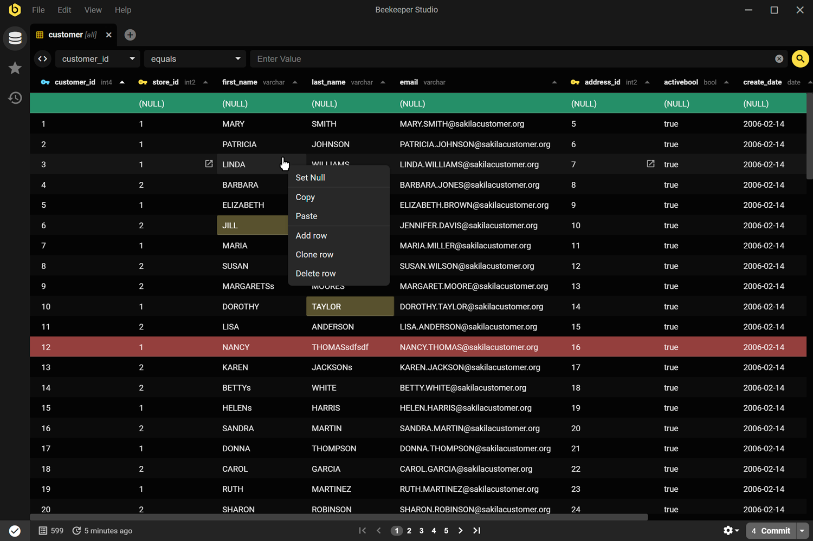
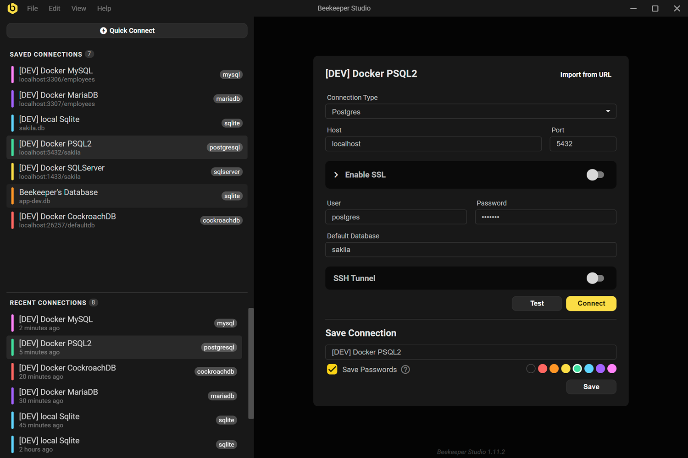
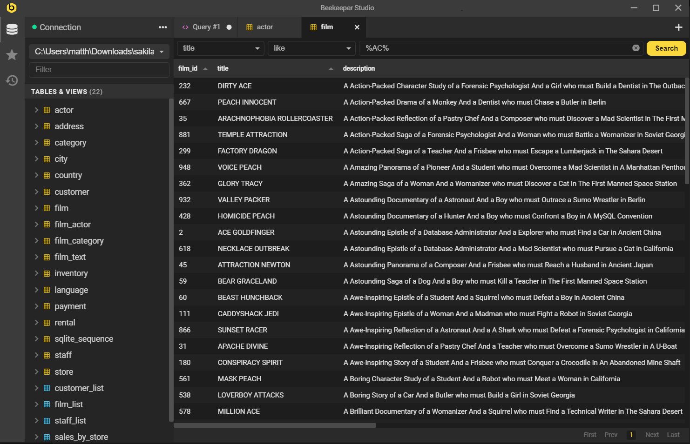

# Beekeeper Studio SQL

Beekeeper Studio SQL is a desktop Beekeeper Studio SQL Editor and Beekeeper Studio database manager for people who live in query tabs. You open a Beekeeper Studio database connection, write SQL, scan a result grid, and leave with a saved query instead of a pile of untitled windows.

This repository is the handbook for that workflow. It covers Beekeeper Studio community edition, Beekeeper Studio pricing, Beekeeper Studio features, and how a Beekeeper Studio SQL client behaves on Beekeeper Studio Windows and Beekeeper Studio Linux as well as macOS.

Beekeeper Studio SQL Editor is not a server and it is not a warehouse. It sits on your workstation, talks to the engines you already run, and keeps the Beekeeper Studio table editor and the Beekeeper Studio data editor in the same window as the query tab.

## Download

Installers and portable builds belong with a version number you can name. Take the current stable package for your system, not a random mirror that only copies the product name.

A useful Beekeeper Studio SQL download answers three questions before you run it:

1. Which edition: Beekeeper Studio community edition or a paid build with extra engines.
2. Which system: Beekeeper Studio Windows, Beekeeper Studio Linux, or macOS.
3. Which CPU: `x64` or `arm64`.

Keep the previous installer until the new one has opened one real database. Early builds exist for testers. They are a poor default on a shared office machine.

Beekeeper Studio docker is a way to stand up the databases you connect to, not a replacement for the desktop Beekeeper Studio SQL Editor. Run Postgres or MySQL in a container, then point the app at `localhost`.

## Running

Install, then start the app from the menu or the extracted folder. First launch asks for a Beekeeper Studio database connection. You can work against a file (Beekeeper Studio sqlite) or against a host (Beekeeper Studio mysql, Beekeeper Studio postgres, SQL Server).

A first session that stays small:

1. Create or open a connection. Save it with a name that includes the environment (`local`, `staging`).
2. Open a Beekeeper Studio SQL Editor tab. Run `select` against a table you know.
3. Open the same table in the Beekeeper Studio table editor and confirm the grid matches the query.
4. Save the query. Close the tab and reopen it from history before you trust the workspace.

If a result grid shows Beekeeper Studio editing disabled, the connection is read-only, the user lacks write rights, or the result is not a simple table. Fix the grant or the query. Do not hunt a hidden "enable edit" switch.

## Editions

Beekeeper Studio open source lives in the community build. Beekeeper Studio community edition covers everyday Beekeeper Studio SQL work: connections, tabs, autocomplete, a spreadsheet-style grid, import and export. Beekeeper Studio pricing exists because extra engines, extra backups, and extra support cost time to keep working.

One installer can unlock paid features later. Pin Beekeeper Studio community edition on a lab machine. Buy a license when the shop needs engines that are not in the free list.

Compare editions only against the engines you actually open. A warehouse you never connect to is not a reason to change the invoice.

## Beekeeper Studio features

Beekeeper Studio features that earn a place in the window:

- Beekeeper Studio SQL Editor with highlighting, completion, and more than one tab.
- Beekeeper Studio table editor and Beekeeper Studio data editor for row-level work without leaving the grid.
- Saved queries and run history, so a statement from Tuesday is not gone on Friday.
- Beekeeper Studio export database paths for CSV, JSON, and SQL dumps you can hand to another tool.
- Beekeeper Studio create database from the connection UI when the engine and the user allow it.
- Keyboard shortcuts that stay out of the way of typing SQL.
- A dark theme that does not fight syntax colors.
- Beekeeper Studio plugins for diagrams, sample views, and extra panels that should not live in the core chrome.
- Beekeeper Studio AI Shell when you want a schema question in prose instead of in `information_schema`.

The Beekeeper Studio SQL client stays a workbench. If a feature would fill the sidebar with twelve unused docks, it stays out.

## Supported databases

### Community version

Beekeeper Studio community edition is built around engines most shops already have:

| Engine | How you usually use it in this app |
| --- | --- |
| Beekeeper Studio postgres / Beekeeper Studio postgresql client | Host, port, database, user. SSH tunnel when the box is not on your LAN. |
| Beekeeper Studio mysql / Beekeeper Studio mysql client | Same shape as Postgres. MariaDB uses the same habits. |
| Beekeeper Studio sqlite / Beekeeper Studio sqlite editor | A file path. Locking and journal mode still belong to SQLite, not to the UI. |
| Beekeeper Studio sql server client | Host, instance or port, and the auth mode your shop actually uses. |
| Redshift, CockroachDB, MariaDB, TiDB, BigQuery, Redis, Greengage | Present when the community driver for that engine is enabled. |

Beekeeper Studio SQL against these engines shares one editor and one grid. Dialects still differ: quotes, `limit`, and types are not portable by wish.

### Paid editions

Paid builds add engines that the community list does not carry, or carries only in preview. The names that show up in search around this product include Beekeeper Studio surrealdb, Beekeeper Studio snowflake, Oracle, Cassandra, Firebird, ClickHouse, DuckDB, MongoDB, Trino, and similar hosts.

A paid engine still needs a correct Beekeeper Studio database connection. A license does not invent a warehouse URL. Read the connection page for that engine before you paste a JDBC-looking string into the wrong field.

Files-as-databases and extra NoSQL hosts belong in the edition that documents them. If the connection dialog does not list the engine, you are on the wrong build.

## Architecture

Beekeeper Studio SQL is a desktop shell with a web UI inside it. The process that owns the window is not the process that talks to every driver in the same way.

- The shell (Electron on desktop) opens windows, file pickers, and OS menus.
- The UI is a Vue app. The two screens that matter are the connection screen and the workspace screen.
- Drivers and query runners live behind that UI. A Beekeeper Studio sqlite file and a Beekeeper Studio postgres host do not share a wire protocol.
- Shared packages hold types and helpers used by more than one app in the monorepo.
- Beekeeper Studio plugins load extra views without rewriting the Beekeeper Studio SQL Editor.

This split is why a blank window is usually a UI problem and a failed `select` is usually a connection or grant problem. Treat them as different layers when you file a bug.

Beekeeper Studio docker setups in this repo are for fixtures: MySQL sample schemas, extra engine containers, things a developer starts before `yarn run`. They are not the product you give a finance team.

## Beekeeper Studio SQL Editor

The Beekeeper Studio SQL Editor is the tab where statements live. One tab, one buffer. Several tabs if you are comparing two queries. Completion reads the schema of the current Beekeeper Studio database connection, so a stale connection gives stale names.

Habits that keep the editor useful:

- Run a highlighted fragment when you only want that fragment. A full-script run is for scripts you meant to run in full.
- Keep `update` and `delete` behind a `select` that returns the same `where`.
- Save a query when it first works. History is a backup, not a filing system.
- If autocomplete dies, reconnect. The schema cache is not psychic.

The editor writes SQL. The engine plans it. A slow query is often an index problem, not a theme problem.

## Table editor and data editor

The Beekeeper Studio table editor opens a grid on one table. Sort, filter, and edit cells when the connection allows writes. The Beekeeper Studio data editor is the same idea for a result set that maps cleanly back to rows.

Beekeeper Studio editing disabled is expected when:

- the connection was saved as read-only
- the database user cannot update that table
- the result is a join, a grouping, or an expression list with no stable key
- the engine is a warehouse that does not take cell edits

Export from the grid when you need a snapshot. Beekeeper Studio export database is the heavier path: a structured dump or a file per table, used for a move or a backup, not for a screenshot of three rows.

Beekeeper Studio create database belongs in the connection or admin UI. It needs a user that is allowed to create catalogs. On a managed cloud host that button may do nothing useful. Create the database in the vendor console, then connect.

## AI integration

Beekeeper Studio AI Shell is an optional pane next to the Beekeeper Studio SQL Editor. You ask about tables and it proposes SQL. You still read the statement before it runs.

A usable AI pane needs:

- a live Beekeeper Studio database connection, so the model sees real names
- a short schema context, not a dump of every catalog in the cluster
- a human who rejects a `delete` that appeared from a vague prompt

Community builds typically talk to a provider you configure (an OpenAI-compatible endpoint is the usual shape). Paid builds may add more providers. Tokens spent on a full schema dump are tokens you will not get back. Send the tables you are actually editing.

The shell does not replace Beekeeper Studio SQL. It drafts. You run.

## Documentation

Handbooks that belong next to this file:

- Installation on Beekeeper Studio Windows and Beekeeper Studio Linux
- Beekeeper Studio database connection pages per engine
- Beekeeper Studio sqlite file locks and WAL notes
- Beekeeper Studio export database formats
- Beekeeper Studio plugins, how to load one, how to write a small one
- Beekeeper Studio AI Shell prompts that stay inside one schema

Write a page when the same question appears twice. A connection screenshot beats a paragraph that names every field.

## Compiling and running locally

You do not need a local build to use Beekeeper Studio SQL. You need one to change it.

1. Install a current Node.js LTS, npm, and Yarn.
2. Fork and clone the source.
3. Install dependencies from the repo root.
4. Start the desktop app in dev mode (`electron:serve` or the script the repo documents this month).
5. Connect to a local engine. Beekeeper Studio docker compose files under `dev/` are there for this.

If OpenSSL errors appear on an old system library, update OpenSSL from the OS package manager, then start again. Do not copy random `.node` binaries from a forum thread.

Where to edit:

- Electron / window code: the background entry.
- Beekeeper Studio SQL Editor and grids: the Vue app, starting from the root application component.
- Connection form: the connection screen.
- Workspace, tabs, table view: the core workspace screen.
- Shared types: `shared` packages, not a one-off copy inside a single view.

A pull request needs a short note and, for UI changes, a small recording. Say which engine you used. Beekeeper Studio postgres and Beekeeper Studio sqlite fail in different ways.

## Feedback

- Bugs: a ticket with the app version, the engine, and the SQL or the connection form that failed.
- Ideas: a discussion, not a one-line issue titled "feature".
- Votes: thumbs on an existing ticket beat a duplicate.
- Beekeeper Studio plugins: open a change against the plugin, not against the SQL editor, when the panel is the thing that broke.

If Beekeeper Studio editing disabled is the whole report, include whether the connection is read-only and whether the same user can `update` in another client. That one fact splits "bug" from "grant".

## License

Beekeeper Studio community edition is GPL-3.0. Paid features that live in the same tree use a commercial license. Trademarks (the name and the marks) are not something you reuse on a fork's installer without reading the trademark note.

Third-party icons and fonts keep their own attribution file. Read it before you redistribute a build.

A Beekeeper Studio SQL Editor session does not relicense your tables. Your schema stays under whatever rules your shop already has.

## First week

Day one, ignore Beekeeper Studio snowflake and Beekeeper Studio surrealdb unless that is the only host you have.

1. Install from a versioned package.
2. Open Beekeeper Studio sqlite on a copy of a file, or Beekeeper Studio postgres on a local container.
3. Run a `select` in the Beekeeper Studio SQL Editor.
4. Edit one harmless row in the Beekeeper Studio table editor, then confirm it from a second query.
5. Save the connection and the query with names you will still understand in a month.

Pin Beekeeper Studio community edition until a missing engine or a missing backup path forces a look at Beekeeper Studio pricing.

## Questions that show up early

### Is Beekeeper Studio SQL only for one engine?

No. The Beekeeper Studio SQL client is the same window. The driver changes. Start with Beekeeper Studio mysql, Beekeeper Studio postgres, or Beekeeper Studio sqlite. Add Beekeeper Studio sql server client or a warehouse when you have the URL and the edition that lists it.

### Do I need a new install for every database?

No. Add a Beekeeper Studio database connection. The application stays installed. Beekeeper Studio create database is a catalog operation, not a second copy of the app.

### Why is the grid read-only?

Beekeeper Studio editing disabled means the result is not a writable table or the user cannot write. Check the connection flag, then the grants, then whether you selected from a join.

### Can I run this next to Docker?

Yes. Beekeeper Studio docker is for the database process. The Beekeeper Studio SQL Editor stays on the desktop and connects to the published port.

### What about plugins?

Beekeeper Studio plugins add panels. They should not replace the Beekeeper Studio SQL Editor. Load one, confirm the connection still queries, then keep it.

## Glossary

| Term | Here |
| --- | --- |
| Beekeeper Studio SQL | The product this file describes: a desktop SQL workbench |
| Beekeeper Studio SQL Editor | The query tab with highlighting and completion |
| Beekeeper Studio SQL client | The same app, seen as a client to an engine |
| Beekeeper Studio database manager | Connections, trees, create and export, not only the editor |
| Beekeeper Studio community edition | The open build you can run without a paid key |
| Beekeeper Studio table editor | Grid on a single table |
| Beekeeper Studio data editor | Grid on a result you are allowed to write back |
| Beekeeper Studio AI Shell | Optional chat that drafts SQL against the current schema |
| Beekeeper Studio database connection | Saved host, file, user, and options for one engine |

## Document history

This file is original text. Screen labels change between versions. When a stable build disagrees with a click path here, the build wins and this page should be edited.

## Related Search Terms

beekeeper studio, beekeeper studio community edition, beekeeper studio pricing, beekeeper studio sql, beekeeper studio mysql, beekeeper studio postgres, beekeeper studio sqlite, beekeeper studio windows, beekeeper studio linux, beekeeper studio sql client, beekeeper studio sql editor, beekeeper studio database manager, beekeeper studio open source, beekeeper studio features, beekeeper studio create database, beekeeper studio docker, beekeeper studio export database, beekeeper studio postgresql client, beekeeper studio mysql client, beekeeper studio sqlite editor
